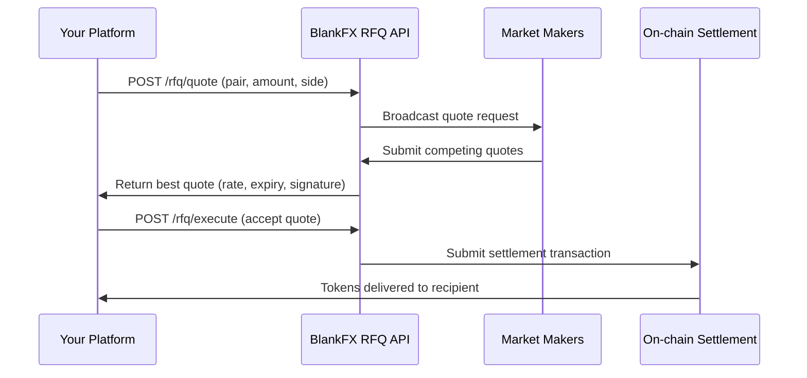

# RFQ Brokerage API

## Overview

The BlankFX RFQ (Request-for-Quote) system enables institutional-grade FX execution. Instead of swapping against pool liquidity, large trades are routed to market makers who compete on price.

This is designed for:
- **Payment platforms** integrating FX capability into their product
- **Corporate treasuries** executing trades above $100K
- **Market makers** providing competitive quotes on BlankFX pairs

## How RFQ works



1. Your platform requests a quote for a specific pair, amount, and direction
2. Market makers receive the request and submit competing quotes
3. The best quote is returned to you with a rate, expiry time, and cryptographic signature
4. You accept the quote within the expiry window
5. Settlement happens atomically on-chain

## API reference

### Authentication

All RFQ API calls require an API key. Contact the BlankFX team to obtain credentials.

```
Authorization: Bearer <your-api-key>
```

### Request a quote

```http
POST /api/rfq/quote
Content-Type: application/json

{
  "pair": "USDC/EURC",
  "amount": "500000",
  "side": "sell",
  "recipient": "0x..."
}
```

| Field | Type | Description |
|-------|------|-------------|
| `pair` | string | Currency pair (e.g. "USDC/EURC", "EURC/USDT") |
| `amount` | string | Amount in base token (native decimals) |
| `side` | string | "buy" or "sell" (relative to base token) |
| `recipient` | string | Wallet address to receive output tokens |

### Quote response

```json
{
  "quoteId": "q_abc123",
  "pair": "USDC/EURC",
  "inputToken": "0x40a9...3dcd",
  "outputToken": "0xf42f...3416",
  "inputAmount": "500000000000",
  "outputAmount": "461200000000",
  "rate": "0.9224",
  "expiresAt": "2026-03-25T18:05:00Z",
  "signature": "0x...",
  "maker": "0x..."
}
```

### Execute a quote

```http
POST /api/rfq/execute
Content-Type: application/json

{
  "quoteId": "q_abc123",
  "signature": "0x..."
}
```

Settlement is atomic. Either the full trade executes at the quoted rate or nothing happens.

### Error codes

| Code | Meaning |
|------|---------|
| `QUOTE_EXPIRED` | Quote expiry time has passed |
| `INSUFFICIENT_BALANCE` | Sender doesn't hold enough input tokens |
| `QUOTE_ALREADY_FILLED` | Quote was already executed |
| `NO_MAKERS_AVAILABLE` | No market makers responded within timeout |
| `ACCESS_DENIED` | API key invalid or sender not registered |

## Integration guide

### For payment platforms

1. **Get API credentials** — Contact the BlankFX team
2. **Approve tokens** — Your platform's settlement wallet needs to approve the RFQ contract for each input token (one-time)
3. **Request quotes** — Call `/rfq/quote` when your user initiates a cross-border payment
4. **Display rate** — Show the quoted rate to your user
5. **Execute** — On user confirmation, call `/rfq/execute`
6. **Confirm settlement** — Monitor the returned transaction hash for on-chain confirmation

### For market makers

Market makers connect via WebSocket to receive quote requests and submit competitive quotes.

```
wss://api.blankfx.org/rfq/ws
```

Contact the BlankFX team for market maker onboarding, including:
- Minimum quote response requirements
- Supported pairs and minimum sizes
- Collateral and settlement requirements

<Info>
The RFQ API is currently in private beta. Contact the BlankFX team for access.
</Info>
