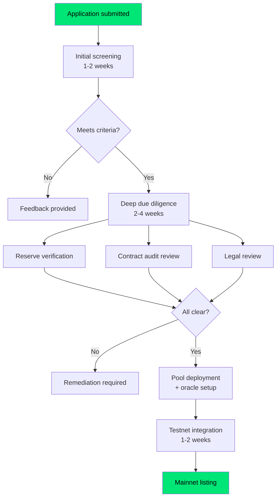

# Stablecoin listing guide

BlankFX is designed to support any fiat-pegged stablecoin that meets our listing criteria. This guide describes what we evaluate, the due diligence process, and how to apply.

## Why list on BlankFX?

Listing your stablecoin on BlankFX gives it:
- **FX liquidity** — your stablecoin becomes tradeable against every other currency on the protocol
- **Institutional access** — corporate treasuries and payment platforms can swap in and out
- **Yield utility** — holders can deposit into the pool and earn from FX trading fees

## Listing criteria

We evaluate stablecoins across five dimensions. All five must pass before a listing proceeds.

### 1. Regulatory and legal standing

| Requirement | Detail |
|-------------|--------|
| Issuer jurisdiction | Must be domiciled in a jurisdiction with clear stablecoin regulation (e.g. EU under MiCA, US state-licensed, Singapore MAS-licensed) |
| License or registration | Issuer must hold relevant e-money, payment, or stablecoin-specific license |
| Legal entity | Must be a registered legal entity (not a DAO or anonymous team) |
| Terms of service | Published terms covering holder rights, redemption, and liability |

### 2. Reserve backing and transparency

| Requirement | Detail |
|-------------|--------|
| Reserve composition | Must be backed 1:1 (or greater) by cash, cash equivalents, or short-term government securities |
| Attestation or audit | Monthly attestation by a reputable accounting firm (Big 4 preferred), or full audit |
| Proof of reserves | On-chain proof of reserves preferred; off-chain attestation accepted with regular frequency |
| Redemption guarantee | Issuer must offer direct redemption to fiat at par value |

### 3. Smart contract quality

| Requirement | Detail |
|-------------|--------|
| ERC-20 compliance | Standard ERC-20 interface on supported chains |
| Audit | At least one audit by a recognized security firm (Trail of Bits, OpenZeppelin, Certora, Consensys Diligence, or equivalent) |
| Upgrade mechanism | If upgradeable, must have timelock and multisig governance |
| Blacklist/freeze | Acceptable if required by regulation, but must be documented |
| Decimal precision | 6 or 18 decimals (6 preferred for FX) |

### 4. Market presence

| Requirement | Detail |
|-------------|--------|
| Market cap | Minimum $10M circulating supply |
| Chain deployment | Must be deployed on Ethereum mainnet or Base (BlankFX-supported chains) |
| Liquidity | Must have existing secondary market liquidity (DEX or CEX) |
| Track record | At least 6 months of stable peg maintenance (within 0.5% of par) |

### 5. Operational readiness

| Requirement | Detail |
|-------------|--------|
| Oracle feed | Chainlink or Pyth price feed available, or issuer willing to co-fund oracle deployment |
| Technical contact | Named technical contact for integration support |
| Incident response | Published incident response process for depeg events |
| Insurance or reserve fund | Preferred: insurance coverage or protocol-level reserve for loss absorption |

## Due diligence process

### Timeline

| Phase | Duration | What happens |
|-------|----------|-------------|
| Application | — | Submit the application form with required documentation |
| Initial screening | 1-2 weeks | BlankFX team reviews against listing criteria |
| Deep DD | 2-4 weeks | Reserve verification, contract review, legal assessment |
| Integration | 1-2 weeks | Testnet deployment, oracle setup, pool configuration |
| Listing | — | Mainnet pool goes live, announced to users |

Total time from application to listing: approximately 4-8 weeks depending on documentation readiness.

## Application

To apply for listing, prepare the following and send to the BlankFX team:

1. **Issuer overview** — Company name, jurisdiction, license details, team
2. **Reserve documentation** — Latest attestation or audit report
3. **Smart contract details** — Token address, audit report, upgrade mechanism documentation
4. **Market data** — Current supply, peg history, existing exchange listings
5. **Oracle availability** — Existing Chainlink/Pyth feeds or willingness to fund deployment
6. **Technical contact** — Named person for integration support

<Info>
Contact the BlankFX team to start the listing process. We're actively seeking stablecoins for EUR, GBP, CHF, AUD, SGD, and AED corridors.
</Info>

## Delisting criteria

A stablecoin may be delisted if:
- Peg deviates more than 2% from par for more than 48 hours
- Issuer loses regulatory license or enters insolvency
- Smart contract exploit affecting token integrity
- Reserve attestation lapses for more than 90 days
- Issuer becomes non-responsive to security or operational queries

Delisting follows a 7-day notice period (except in emergency situations) to allow LPs to withdraw.
